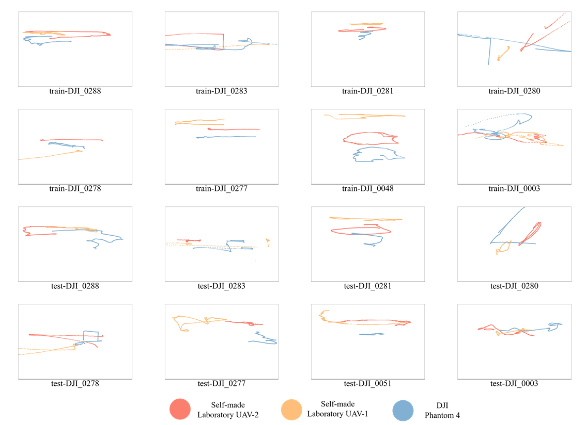
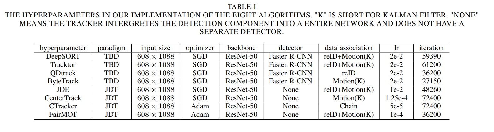
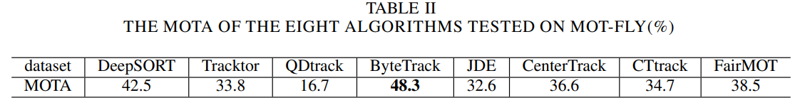

# An Experimental Evaluation Based on New Air-to-Air Multi-UAV Tracking Dataset

**Authors:** Beijing Institute of Technology, Zhaochen Chu, Tao Song, Ren Jin*

The HD video is available on [MOT FLY DATASET - YouTube](https://www.youtube.com/watch?v=t-QuK7Wi63A)

## Abstract:

Visual-based multi-object tracking (MOT) of micro unmanned aerial vehicles (UAVs) is one of the critical technologies affecting the development of UAVs. It can be applied in cooperative UAV formation, UAV countermeasure system development in complex environments, multi-UAV logistics and other fields. However, the performance of existing visual-based multi-object tracking algorithms in UAVs has not been evaluated. To alleviate this situation, we provide a comprehensive air-to-air multi-UAV tracking dataset, MOT-FLY, consisting of more than 11 000 images of three types of UAVs. The images cover multiple backgrounds, different viewing angles, lighting conditions, UAV sizes, target movement patterns, and numerous challenging scenarios that can serve as a benchmark for evaluating representative multi-object tracking algorithms. Furthermore, this paper designs evaluation experiments for eight representative MOT algorithms based on the proposed dataset. The results reveal the influence of the composition of the dataset, network structure, and image characteristics on the algorithms. Then we put forward some suggestions on the difficulties faced in developing air-to-air multi-UAV tracking and some potential ideas for future directions of the algorithms. The dataset is available at https://github.com/CZC-123/MOT-FLY.

## Main Contributions:

First, this paper presents a dataset of 11 186 images of multiple UAV objects (DJI Phantom 4 and two types of self-made laboratory UAVs) acquired by another flying UAV (DJI Mavic). To the best knowledge, it is the first air-to-air multi-UAV object tracking dataset. Compared to the existing air-to-air datasets, the proposed design is more systematic and comprehensive because it contains different background scenes, view angles, UAV sizes, relative distance, flight altitude, and lighting conditions. The background scenes vary from simple ones (e.g., clear and cloudy sky) to complex ones (e.g., urban, field). The relative distance of the UAV objects is from 5m to 100m, and the flight altitude is from 10m to 50m. The data collection varies from morning to evening in different periods of the day. The dataset also contains challenging scenarios, such as UAVs appearing and disappearing, strong/weak light, and partial object occlusion. 

Second, based on our proposed MOT-FLY dataset, this paper presents an experimental evaluation of eight representative deep learning algorithms that perform well in general multi-object tracking datasets, including DeepSORT, Tracktor, QuasiDense track (QDtrack) , ByteTrack , JDE, FairMOT, CenterTrack and CTracker. Among the selected methods, DeepSORT, Tracktor, QDtrack, and ByteTrack are TBD trackers, while JDE, FairMOT, CenterTrack, and CTracker are JDT trackers. To our knowledge, this is the first comprehensive evaluation of deep learning algorithms for multi-UAV tracking. The evaluation results show that ByteTrack and FairMOT are superior to the others. In addition, we also evaluate the impact of key factors such as background scene complexity, object sizes, and target motion complexity on the multi-object tracking performance.

The proposed dataset could be used as a benchmark to evaluate multiple UAV tracking algorithms. The evaluation results highlight some key challenges in the problem of air-to-air multi-UAV tracking and suggest potential ways to develop new algorithms in the future.

## UAVs

`Phantom`


`self-made liboratory UAV-1`


`self-made laboratory UAV-2`


`Mavic`


## Data Format

The dataset format is the same as MOTChallenge.

```
MOT-FLY
├── train
│   ├── DJI_0003_D_S_E
│   │   ├── det
|   │   │   ├── det.txt
│   │   ├── gt
│   │   │   ├── gt.txt
│   │   ├── img1
│   │   │   ├── 000001.jpg
│   │   │   ├── 000002.jpg
│   │   │   ├── 000003.jpg
│   │   │   ├── ...
│   │   ├── seqinfo.ini
│   ├── DJI_0048_D_S_E
│   ├── DJI_00277_L_S_H
│   ├── ...
├── test
|   ├── ...
```

## Sequence

| Name                   | Image size       | Background | Num   | instance |
| ---------------------- | ---------------- | ---------- | ----- | -------- |
| DJI_0003_D_S_E (train) | $1080\times1920$ | Village    | 513   | 1452     |
| DJI_0048_D_S_E (train) | $1080\times1920$ | Flat       | 742   | 2232     |
| DJI_0277_L_S_H (train) | $1080\times1920$ | Urban      | 761   | 2283     |
| DJI_0278_L_M_H (train) | $1080\times1920$ | Urban      | 643   | 1901     |
| DJI_0280_L_M_E (train) | $1080\times1920$ | Sky        | 635   | 1588     |
| DJI_0281_D_S_H (train) | $1080\times1920$ | Village    | 683   | 2049     |
| DJI_0283_D_M_H (train) | $1080\times1920$ | Urban      | 777   | 1692     |
| DJI_0288_D_M_E (train) | $1080\times1920$ | Village    | 742   | 2226     |
| DJI_0003_D_S_E (test)  | $1080\times1920$ | Village    | 534   | 1602     |
| DJI_0051_L_S_E (test)  | $1080\times1920$ | Flat       | 630   | 1895     |
| DJI_0277_L_S_H (test)  | $1080\times1920$ | Urban      | 937   | 2824     |
| DJI_0278_L_M_H (test)  | $1080\times1920$ | Urban      | 636   | 1675     |
| DJI_0280_L_M_E (test)  | $1080\times1920$ | Sky        | 636   | 1881     |
| DJI_0281_D_S_H (test)  | $1080\times1920$ | Village    | 796   | 1387     |
| DJI_0283_D_M_H (test)  | $1080\times1920$ | Urban      | 786   | 1830     |
| DJI_0288_D_M_E (test)  | $1080\times1920$ | Village    | 735   | 2205     |
| **SUM**                |                  |            | 11186 | 31722    |

## Ground Truth

The ground truth of position distribution of UAV objects in 16 sequences of MOT-FLY.



## Baseline





## License

This work is under the **Apache 2.0** license.

## Download

MOT-FLY: **Baidu Drive：**https://pan.baidu.com/s/1eS84Ooz0URojz1tAJNZ5Eg?pwd=pe53  code: pe53 


